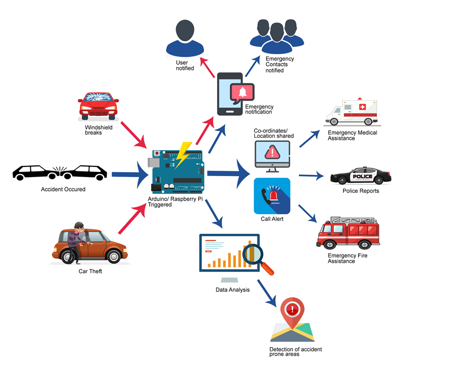
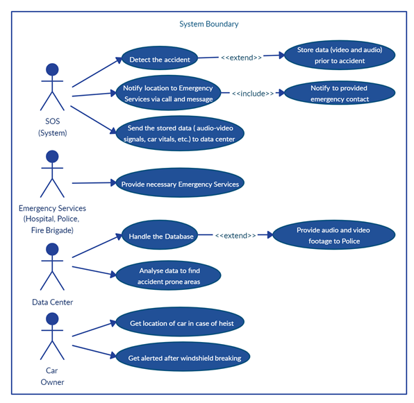

# SOS-Car-Accident-Care-System
In order to reduce the time delay in deploying emergency care during car accidents, we propose “SOS” - a system which automates the process of informing the nearest emergency services and your family about the accident.

## Abstract : 
- In the event of an accident, the impact sensors connected to Airbags will actuate the system thus triggering a countdown after which the system will :
Automatically make an emergency call to the nearest accident care systems (e.g. Emergency Medical services, Police stations and Fire brigade) and emergency contacts provided by the registered user.
- Further sending  them a notification via Desktop App and Mobile App, informing them about the location and time of the accident.
- The system will preserve the video footage & audio of a short period prior to the accident, which will be recorded via the cameras installed in the car and  the vitals of the car: speed, RPM, tyre pressure, fuel level etc. will also be uploaded to the database.
- This data will be available for the Police for further investigation.
- This data will also be provided to Ministry of Shipping Road Transport and Highways on a dedicated Website powered by sophisticated ML algorithms which will help them  for further analysis and better visualization of data and aid in identifying the specific accident prone regions and take necessary actions to reduce the accident rates. 
- Car Theft will be avoided by acquiring the location of the registered car anytime at a press of a button in the Mobile App. 
- Windshield breaking will be identified via sensors and  the user will be alerted via the Mobile App.

## Working Diagram : 

## Use Cases : 

## Technology Stack :
Node, Angular, Firebase, Python, Raspberry Pi, Flutter

